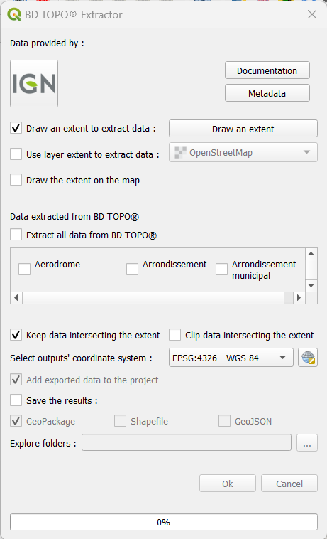
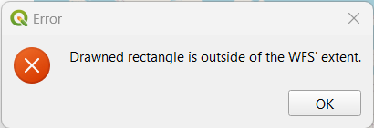
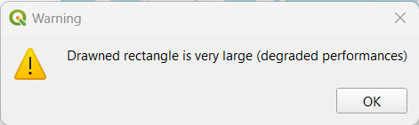

# BD TOPO® Extractor

[Documentation en français](https://github.com/JulesGrillot/plugin_bd_topo_extractor/blob/main/bd_topo_extractor/README_fr.md)

## Description

### What's the point

This tool allows you to extract specific data from IGN's BD TOPO®. The extraction is based on either an extent drawned by the user on the map canvas or a layer's extent.

### How to use it

Only 4 steps are required to use the BD TOPO® Extractor :

1. Select the extent you want to use to extract data.

1. Select the data you want to extract.

1. Select if you want to clip the data based on the extent or keep all the features intersecting the extent intact.

1. Select if you want to save the result or not, and if so the output folder and output format.

## Documentation

This is the plugin's User Interface :

### Select an extent

You can either draw a rectangle on the map (default) or select a layer in your project and use it's extent.

First you need to check the right checkbox :

- `Draw an extent to extract data :` if you want to use a drawned extent. Then you have to click the `Draw an extent` button and create a rectangle on the map.

- `Use layer extent to extract data :` if you want to use a layer's extent. Check it and then use the combobox to select the layer you want to use.

2 error message can appear :

1. The selected layer or the drawned rectangle is outside of the total extent of the WFS data.

2. The drawned rectangle is too big, the process can take a long time.

The max extent of the WFS data can be added to the map with the checkbox `Draw the extent on the map`.

### Select data to export

All data in the WFS are listed in the middle part of the UI.
You can either select all of the data with the checkbox `Extract all data from BD TOPO®` or select only the wanted data by checking their respectives checkboxes.

### Select output geometry

You can extract all features intersecting the extent (default) by checking `Keep data intersecting the extent` or choose to clip all features with the extent by checking `Clip data intersecting the extent`.

### Select output format

If you don't want to save the extracted data as layers (default) you only have to select the output crs with the combobox.

If you want to save the extracted data as layers you have to :

- select the output crs with the combobox.
- check the `Save the results :` checkbox.
- select if you want to add the exported data to the project (default) or not.
- select the output format, `GeoPackage` (default), `Shapefile` or `GeoJSon`.
- select the output folder to save the new layers inside a folder called `BDTopoExport_yyyymmdd_HHMM`.

If GeoPackage format is selected, only one file is created inside the folder with all layers inside.

The extraction begin when you press the `OK` button.

### Additional tools

By clicking the IGN button, you'll be redirected to [`IGN's website`](https://www.ign.fr/).
By clicking the `Documentation` button, you'll be redirected to this page.
By clicking the `Metadata` button, you'll be redirected to the [`description of the BD TOPO® by IGN`](https://geoservices.ign.fr/bdtopo).
An OpenStreeMap basemap is automatically added to the project if there is no layer in it. So the user can draw a rectangle.
