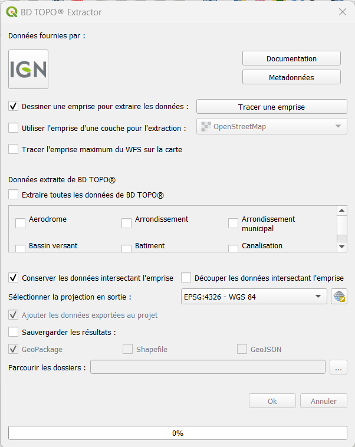
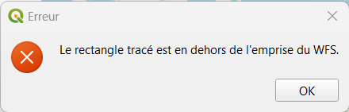
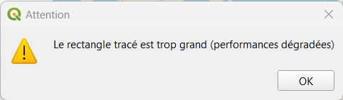

# BD TOPO® Extractor

## Description

### Quel est l'intérêt

Cet outil permet d'extraire une, plusieurs ou toutes les données de la BD TOPO® de l'IGN. Cette extraction est réalisée grâce à une emprise dessiner par l'utilisateur sur la carte ou basée sur l'emprise d'une couche.

### Comment on l'utilise

4 étapes sont nécéssaires pour utiliser le BD TOPO® Extractor :

1. Sélectionner une emprise à utiliser pour l'extraction.

1. Sélectionner les données à extraire.

1. Sélectionner si l'on souhaite découper les données extraites par l'emprise ou garder les entités intersectant l'emprise intactes.

1. Sélectionner si vous souhaitez sauvegarder le résultat et sous quel format.

## Documentation

Voici l'interface utilisateur du plugin :

### Sélectionner une emprise

Il est possible soit de dessiner une emprise sur la carte (option par défaut) ou de sélectionner une couche et utiliser son emprise.

Il faut d'abord cocher la bonne checkbox :

- `Dessiner une emprise pour extraire les données :` si vous voulez dessiner l'emprise. Il faut ensuite cliquer sur le bouton `Tracer une emprise` puis tracer un rectangle sur la carte.

- `Utiliser l'emprise d'une couche pour l'extraction :` pour utiliser l'emprise d'une couche. Il faut cocher la checkbox puis sélectionner la couche à utiliser.

2 messages peuvent apparaître :

1. L'emprise est en dehors de l'emprise maximale du WFS.

2. L'emprise est trop important, les performances risques d'êtres dégradées.

Il est possible d'ajouter l'emprise maximum du WFS grâce au bouton `Tracer l'emprise maximum du WFS sur la carte`.

### Sélectionner les données à extraire

Toutes les données du WFS sont listées dans la partie centrale de l'interface. Il est possible de sélectionner toutes les données en cochant la checkbox `Extraire toutes les données de BD TOPO®` ou de sélectionner uniquement une ou plusieurs données en cochant les checkboxes souhaitées.

### Sélectionner la géométrie des données exportées

Il est possible d'extraire toutes les données qui intersecte l'emprise choisis (option par défaut) en cochant `Conserver les données intersectant l'emprise`. Il est également possible de découper les données par l'emprise en cochant `Découper les données intersectant l'emprise`.

### Sélectionner le format de sortie

Si vous ne souhaitez par sauvegarder les données extraites (option par défaut), seul le système de projection doit être sélectionné à l'aide de la combobox.

Si vous souhaitez sauvegarder les données extraites il vous faut :

- sélectionnez le système de projection.
- cochez la checkbox `Sauvergarder les résultats :`.
- sélectionnez si il faut ajouter les données au projet (option par défaut) en cochant la checkbox `Ajouter les données exportées au projet` ou non.
- sélectionnes le format des données en sortie, `GeoPackage` (option par défaut), `Shapefile` ou `GeoJSon`.
- Sélectionnez le dossier de sortie, un dossier sera créer avec le nom suivant `BDTopoExport_aaaammjj_HHMM`.

Si le format GeoPackage est sélectionné, seul un fichier sera créer qui contiendra toutes les données.

L'extraction commence lorsque vous pressez le bouton `OK`.

### Outils supplémentaires

Un clic sur le logo de l'IGN permet d'ouvir leur [site internet](https://www.ign.fr/).
Un clic sur le bouton `Documentation` permet d'ouvrir la [page github du plugin](https://github.com/JulesGrillot/plugin_bd_topo_extractor/tree/main/bd_topo_extractor#bd-topo-extractor---qgis-plugin).
Un clic sur le bouton `Metadonnées` permet d'ouvrir la page de [`description de la BD TOPO® par l'IGN`](https://geoservices.ign.fr/bdtopo).
Un fond de carte OpenStreetMap est automatiquement ajouté au projet si il est vide lorsque le plugin est lancé. Afin de simplifier le traçage d'une emprise.
